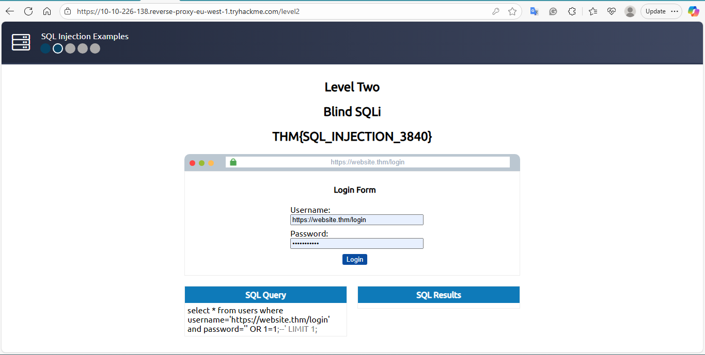

# Level 2 – Blind SQLi (Task 6)

**Date recorded:** 2025-09-24

**Lab Objective:** Retrieve the flag by exploiting a Blind SQL Injection vulnerability.

**SQL Query executed:**
SELECT * FROM users WHERE username='' AND password='' OR 1=1;

**Result / Notes:**
- Bypasses authentication by always returning true.
- Reveals the flag for Task 6.
- Performed in a safe TryHackMe lab environment.

**Recovered Data:**
Flag: THM{SQL_INJECTION_9581}

**Screenshot:**

**What I Learned:**
- Blind SQLi does not display errors; results are inferred from behavior.
- Logical statements can bypass authentication.
- Carefully crafted payloads are crucial for testing true/false responses.